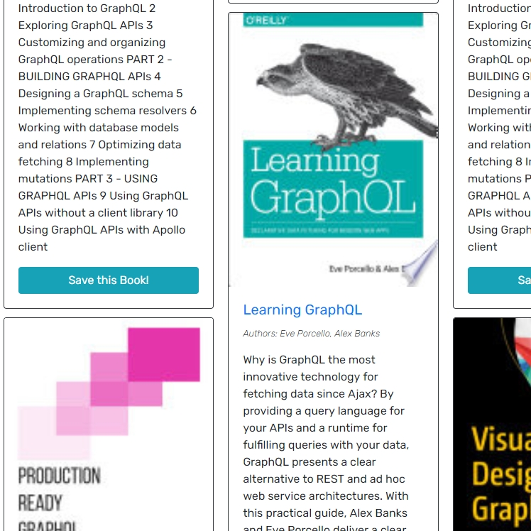

# Bookbindr

## Description

Bookbindr is a book search app that uses Google's API to return a list of books based on user queries. These books can then be saved to the logged-in user's account for later reference, or deleted. It uses GraphQL to handle all API requests, and React for rendering the front end.

## Table of Contents

- [Installation](#installation)
- [Usage](#usage)
- [License](#license)
- [Questions](#questions)

## Installation

Clone this repository with `git clone <url>`, then in the root directory run `npm install` to install all dependencies in both the server and client folders.

## Usage

To start both the front-end and back-end development servers, in the root directory run `npm run develop`.

The deployed application can be viewed [here]().

## License

[The MIT License](https://mit-license.org/)

Copyright © 2022 branjames117

Permission is hereby granted, free of charge, to any person obtaining a copy of this software and associated documentation files (the “Software”), to deal in the Software without restriction, including without limitation the rights to use, copy, modify, merge, publish, distribute, sublicense, and/or sell copies of the Software, and to permit persons to whom the Software is furnished to do so, subject to the following conditions:

The above copyright notice and this permission notice shall be included in all copies or substantial portions of the Software.

THE SOFTWARE IS PROVIDED “AS IS”, WITHOUT WARRANTY OF ANY KIND, EXPRESS OR IMPLIED, INCLUDING BUT NOT LIMITED TO THE WARRANTIES OF MERCHANTABILITY, FITNESS FOR A PARTICULAR PURPOSE AND NONINFRINGEMENT. IN NO EVENT SHALL THE AUTHORS OR COPYRIGHT HOLDERS BE LIABLE FOR ANY CLAIM, DAMAGES OR OTHER LIABILITY, WHETHER IN AN ACTION OF CONTRACT, TORT OR OTHERWISE, ARISING FROM, OUT OF OR IN CONNECTION WITH THE SOFTWARE OR THE USE OR OTHER DEALINGS IN THE SOFTWARE.

## Questions

This repository was created and is maintained by [branjames117](https://github.com/branjames117).

With any questions email the repository owner at [branjames117@gmail.com](mailto:branjames117@gmail.com).
